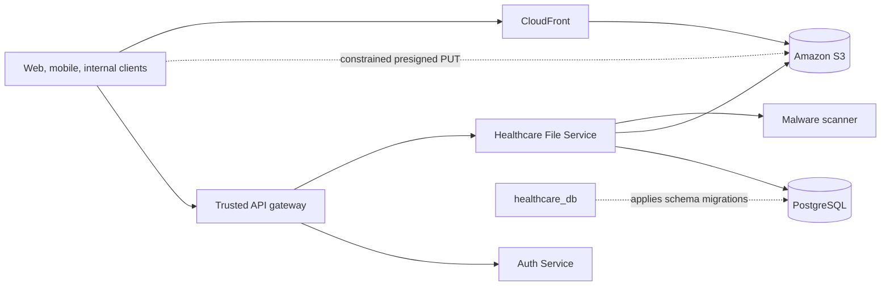
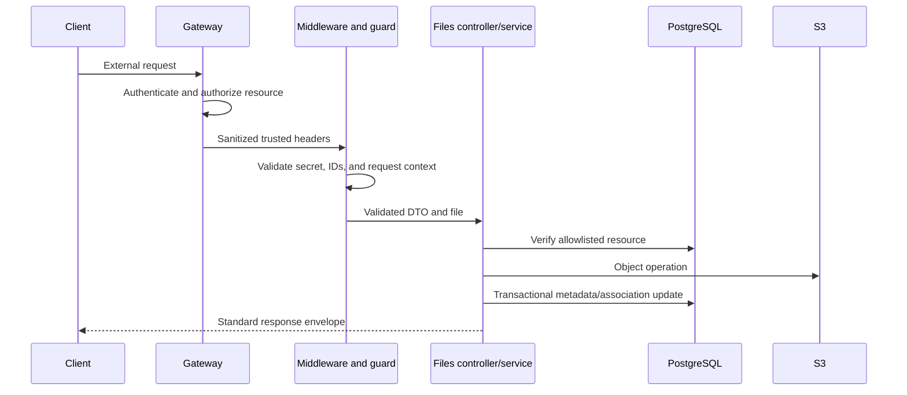
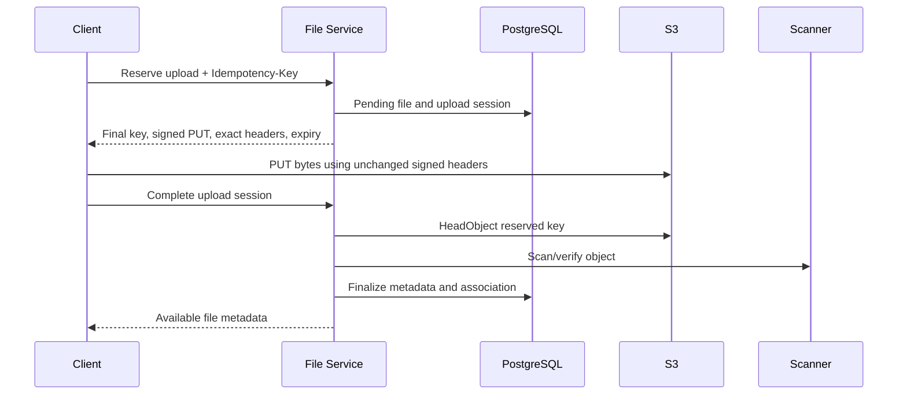

# Healthcare File Service Architecture

## 1. Purpose

Healthcare File Service is the bounded context for file validation, object-storage interaction, metadata, and associations between files and healthcare resources. It separates binary object storage from relational metadata and provides controlled public and private access workflows.

This document explains service design. Runtime values belong in [`.env.example`](.env.example), operations in [`docs/DEPLOYMENT.md`](docs/DEPLOYMENT.md), S3 provisioning in [`docs/S3_SETUP.md`](docs/S3_SETUP.md), and API contracts in [`docs/API.md`](docs/API.md).

## 2. System context



The gateway authenticates callers, authorizes access to the target healthcare resource, strips untrusted identity headers, and injects trusted request context. The file service treats this context as an internal trust input; it does not implement JWT verification or domain authorization.

PostgreSQL records canonical file state and associations. S3 stores bytes. CloudFront may deliver public assets from a non-public S3 origin. Private downloads use short-lived S3 presigned URLs after authorization.

## 3. Responsibilities and boundaries

### In scope

- File category, visibility, size, extension, declared type, and detected-byte validation
- Server-generated object keys and public/private bucket selection
- Server-side uploads and direct presigned PUT workflows
- Metadata, upload-session, variant, access-event, and resource-association persistence
- Public image variant creation
- Private download signing and access-event recording
- Replacement, soft deletion, bulk deletion, and compensating storage cleanup
- Stable response envelopes, errors, request correlation, structured logging, and health probes

### Out of scope

- Authentication, token issuance, and patient/resource authorization decisions
- PostgreSQL schema creation, TypeORM synchronization, or migration execution
- S3 bucket, KMS key, CloudFront, VPC endpoint, or IAM provisioning
- A production malware scanner in the current source tree
- Generic access to arbitrary database tables, buckets, prefixes, or object keys
- Legal-retention policy decisions and records-management approval

## 4. Internal structure

```text
src/
├── main.ts                         # Nest bootstrap, security, validation, Swagger
├── app.module.ts                   # Module composition and structured logging
├── common/                         # Envelopes, exceptions, guards, context, utilities
├── config/                         # Environment validation and typed configuration
├── database/                       # Existing-schema TypeORM mappings
└── modules/
    ├── files/                      # HTTP API and file workflow orchestration
    ├── storage/                    # Storage contract and AWS SDK v3 adapter
    ├── image-processing/           # Sharp public-image variants
    ├── file-scanning/              # Scanner contract and development adapter
    └── health/                     # Process and dependency health
```

Controllers handle HTTP input and delegate to `FilesService`. The service coordinates validation, scanning, S3 operations, database transactions, and compensation. `S3StorageService` is the only component that sends AWS S3 commands. `ResourceMappingService` is the only source of database identifiers used for domain associations.

## 5. Trust and request lifecycle



Configured trusted headers carry an internal service secret, request ID, correlation ID, user ID, actor ID, roles, and idempotency key. These are not proof of identity when clients can reach the service directly. Network policy must prevent gateway bypass.

The global validation pipe transforms typed values, whitelists DTO properties, and rejects unknown input. Helmet supplies HTTP security headers. CORS is disabled by default and, when enabled, uses an explicit origin list.

## 6. Resource association model

Clients submit a resource type and UUID, never a schema, table, column, bucket, prefix, or object key. A static allowlist maps each supported resource to:

- its verified database schema and table;
- direct foreign-key or link-table association semantics;
- its required file category;
- allowed public or private visibility;
- soft-delete behavior and bounded optional metadata.

Supported mappings cover public catalogue/profile assets and private prescription, diagnostic, organization, compliance, insurance, support, finance, logistics, appointment, procurement, and notification documents. The service verifies the target record and builds SQL identifiers only from the internal map; request values remain parameters.

`healthcare_db` remains the sole authority for these tables and columns. Adding or changing a mapping requires verifying the matching database revision and deploying the migration before compatible service code.

## 7. Object-key design

The server generates keys in this shape:

```text
{environment}/{visibilityPrefix}/{resourceType}/{resourceId}/{year}/{month}/{objectName}
```

Private object names are random UUIDs plus a validated extension. Public names combine a UUID and sanitized filename. Image variants live below the source directory:

```text
.../variants/{variantName}/{sourceStem}-{variantName}.webp
```

Keys must not contain patient names, contact details, diagnosis text, prescription content, or other clinical data. Bucket names, KMS aliases, CloudFront paths, tags, and operational metrics must follow the same rule. UUID resource identifiers remain sensitive operational metadata and should not be broadly exposed.

## 8. Server-side upload

1. Validate the allowlisted resource, category, and visibility.
2. Verify the domain record exists.
3. Validate request limits, filename, declared MIME type, extension, and detected byte type.
4. Compute SHA-256 and invoke the scanner contract.
5. Generate a non-guessable server-controlled key.
6. Upload the source and any eligible public image variants.
7. In one PostgreSQL transaction, persist metadata, scan events, variants, and the domain association.
8. If the transaction fails, delete newly uploaded objects as compensation.
9. For replacement, commit the new association before best-effort cleanup of the old object.

Server-side multipart bodies are memory-buffered by Multer. They are appropriate only within configured size and concurrency limits. Direct-to-S3 is preferred for larger payloads.

## 9. Presigned upload



The idempotency key is scoped and bound to a fingerprint of normalized reservation inputs. It cannot be reused for a different request. The key and bucket are generated by the service, and the signed request constrains content type, size, cache behavior, encryption headers, and `x-amz-meta-sha256`.

Completion loads only the reserved key, verifies S3 metadata and size using `HeadObject`, invokes the scanner, and finalizes state transactionally. A repeated successful completion returns the same file. Expired or inconsistent sessions are rejected and trigger best-effort cleanup.

The SHA-256 metadata value is supplied by the client and protects reservation consistency; by itself it is not proof that the bytes have that digest. A production scanner or verification adapter must stream the object and independently verify content when integrity assurance is required.

## 10. Public and private delivery

### Public files

Only allowlisted public categories may enter the public bucket. Stable URLs prefer `AWS_CLOUDFRONT_PUBLIC_BASE_URL`, followed by an explicitly configured S3-compatible base URL. Object keys are unique, so long-lived immutable caching does not require overwrite invalidations.

The S3 public bucket is not anonymously readable or writable. CloudFront Origin Access Control receives narrowly scoped `GetObject` permission. Public writes still require the service role or a constrained presigned PUT.

### Private files

Private records never receive permanent public URLs. Before signing a download, the service confirms that metadata is active, available, clean, and not deleted. It then creates a short-lived `GetObject` URL, records an access event, and returns `private, no-store` behavior.

Presigned URLs are bearer capabilities. They must not be logged, stored in permanent records, included in analytics parameters, or cached by shared infrastructure.

## 11. Persistence model

The service maps existing `platform` tables:

- `file_objects` — canonical bucket, key, owner, content, checksum, encryption, status, retention, and audit metadata;
- `file_upload_sessions` — persistent idempotency and presigned workflow state;
- `file_variants` — source-to-derived-object relationships;
- `file_access_events` — append-only private access and signing decisions;
- `file_scan_events` — scan outcomes accessed through bounded SQL.

Domain tables hold direct file UUIDs or link-table rows according to the allowlist. TypeORM always has `synchronize`, `migrationsRun`, and `dropSchema` disabled. The application contains no migrations and never calls schema-creation APIs.

## 12. Cross-system consistency

S3 and PostgreSQL cannot share an atomic transaction. The service uses ordered operations and compensation:

| Workflow | Ordering | Failure behavior |
|---|---|---|
| New server upload | S3, then database transaction | Delete uploaded objects if persistence fails |
| Presigned completion | Existing object, then finalization | Reject/fail session and attempt object cleanup |
| Replacement | New object, transactional reference swap, old cleanup | Keep valid new reference if old cleanup fails |
| Delete | Clear association and soft-delete metadata, then S3 delete | Return partial failure and allow safe retry |
| Move | Copy destination, then delete source | Preserve source when copy fails |

Compensation is necessarily best effort. Production needs reconciliation that detects expired sessions, deleted/rejected metadata with remaining objects, missing objects for active metadata, and untracked objects. Cleanup must honor retention and legal-hold policy.

Optimistic row versions and database uniqueness constraints protect concurrent updates and idempotency. Do not replace these controls with process-local locks; the service is designed for multiple replicas.

## 13. Security model

- Deploy in private subnets behind a trusted gateway or service mesh.
- Use workload identity instead of long-lived AWS access keys.
- Separate public and private buckets and keep all S3 Block Public Access settings enabled.
- Keep ACLs disabled with Bucket owner enforced ownership.
- Encrypt objects with an approved S3 or KMS policy and require TLS.
- Grant the runtime role only the exact bucket prefixes and KMS operations it needs.
- Redact signed URLs, secrets, authorization, cookies, filenames, connection strings, and clinical payloads.
- Keep Swagger and application CORS disabled unless an explicit protected use case requires them.
- Replace the development no-op scanner before production.

For complete controls and policies, use [`docs/S3_SETUP.md`](docs/S3_SETUP.md).

## 14. Health and observability

- `/health/live` reports process liveness without contacting dependencies.
- `/health/ready` runs a read-only PostgreSQL query and independent `HeadBucket` checks for both configured buckets.
- A dependency outage returns a normalized `503` with boolean status, not credentials or endpoints.
- Pino emits request, correlation, route, status, and service context with configured redaction.

Monitor request rate and latency, upload size, memory, database pools, S3 4xx/5xx responses, signing failures, pending and expired sessions, scan outcomes, compensation failures, partial deletes, missing-object reconciliation, and private access anomalies.

## 15. Extension points

- Replace the scanner contract with synchronous ClamAV or an asynchronous quarantine/event workflow.
- Add a reconciliation worker without changing HTTP controllers.
- Add a storage adapter through the storage interface when semantics match S3.
- Add multipart presigned uploads with persisted part state and explicit abort handling.
- Add CloudFront signed delivery for restricted high-volume content if authorization and cache policy require it.

Each extension must preserve server-controlled keys, allowlisted resource associations, auditable state transitions, short-lived capabilities, and database migration ownership.
