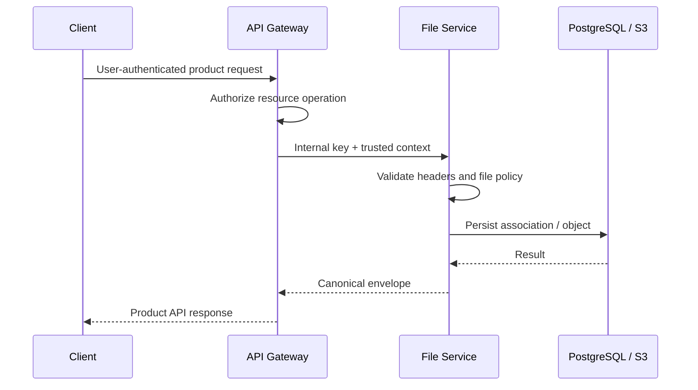
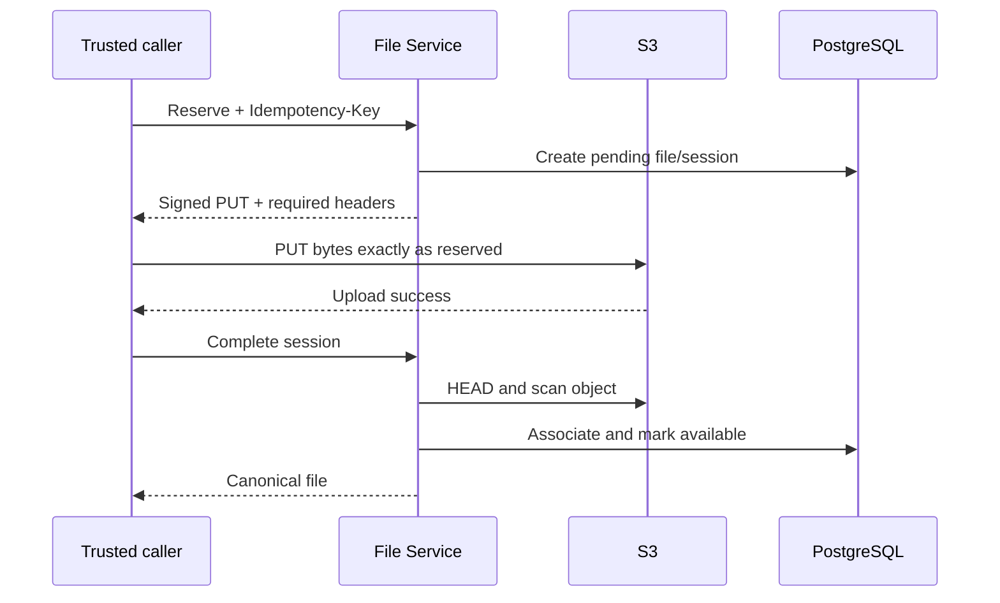

# Healthcare File Service API Reference

> **Service:** `healthcare-file-service`  
> **API version:** `v1`  
> **Document status:** implementation-aligned reference  
> **Last reviewed:** 2026-08-18  
> **Audience:** API Gateway teams, backend service teams, web/mobile integration teams, SRE, QA, and security reviewers

This document is the consumer contract for the Healthcare File Service. It describes every implemented HTTP endpoint, request and response shape, authentication requirement, resource-association rule, validation policy, failure condition, and recommended workflow.

The service is an **internal platform service**, not a public client API. A trusted API Gateway or backend service should authenticate and authorize the end user, attach trusted identity context, and call this service using the internal service credential. Browsers and mobile applications should normally call the product API, not this service directly.

---

## 1. Integration overview

### 1.1 Environments and base URL

The deployment owner supplies the host name. Examples below use:

```text
https://files.internal.example.com
```

| Surface       | Default path              | Prefix behavior          | Purpose                                |
| ------------- | ------------------------- | ------------------------ | -------------------------------------- |
| Versioned API | `/api/v1`                 | `API_PREFIX/API_VERSION` | File operations                        |
| Liveness      | `/health`, `/health/live` | Not version-prefixed     | Process probe                          |
| Readiness     | `/ready`, `/health/ready` | Not version-prefixed     | PostgreSQL and S3 dependency probe     |
| Swagger UI    | `/docs`                   | Not version-prefixed     | Interactive reference when enabled     |
| OpenAPI JSON  | `/openapi.json`           | Not version-prefixed     | Machine-readable contract when enabled |

`API_PREFIX`, `API_VERSION`, Swagger availability, and all trusted header names are deployment-configurable. This reference uses their defaults. Consumers should obtain the deployed base URL and header configuration from the platform team rather than hard-code environment host names.

### 1.2 Media types and field naming

- JSON endpoints consume and return `application/json`.
- Server-side upload and replacement endpoints consume `multipart/form-data`.
- Direct-to-S3 upload uses the exact content type and headers returned by the reservation endpoint.
- JSON fields use `camelCase`.
- Resource, category, visibility, and status values use lowercase `snake_case` enums.
- Identifiers are UUIDs. Path IDs and upload-session IDs specifically require UUID v4.
- Timestamps are ISO 8601 UTC strings.
- SHA-256 values are 64 hexadecimal characters.
- Unknown request properties are rejected; clients must not send speculative fields.

### 1.3 Authentication modes

| Endpoint group            |         Bearer token |                              `X-Internal-Service-Key` |   Trusted identity headers | Intended caller                  |
| ------------------------- | -------------------: | ----------------------------------------------------: | -------------------------: | -------------------------------- |
| `/health`, `/health/live` |                   No |                                                    No |                         No | Orchestrator/load balancer       |
| `/ready`, `/health/ready` |                   No |                                                    No |                         No | Orchestrator/load balancer       |
| `/api/v1/files/**`        |             Not used | Required when `INTERNAL_SERVICE_SECRET` is configured | Optional, gateway-supplied | API Gateway or trusted backend   |
| `/docs`, `/openapi.json`  | No application guard |                                  No application guard |                         No | Restricted operator network only |

The file service does **not** validate an `Authorization: Bearer ...` token. End-user authentication and permission checks belong at the gateway or calling product service. The internal service key authenticates the hop between trusted services; it does not prove what an end user is allowed to do.

Production rule: configure a strong `INTERNAL_SERVICE_SECRET`, keep the service on a private network, restrict Swagger operationally, and prevent clients from bypassing the gateway. If the secret is empty, the guard deliberately permits file requests for local development; that setting is unsafe for a shared or production deployment.

### 1.4 Trusted request headers

| Default header           |                   Required | Format/limit                         | Meaning                                                                        |
| ------------------------ | -------------------------: | ------------------------------------ | ------------------------------------------------------------------------------ |
| `X-Internal-Service-Key` |                Conditional | Exact shared secret                  | Authenticates the trusted internal hop                                         |
| `X-Request-ID`           |                         No | UUID                                 | Per-request identifier; generated when omitted                                 |
| `X-Correlation-ID`       |                         No | UUID                                 | Cross-service trace identifier; defaults to request ID                         |
| `X-User-ID`              |                         No | UUID                                 | Authenticated subject injected by the gateway                                  |
| `X-Actor-ID`             |                         No | UUID                                 | Acting administrator, service identity, or delegated actor                     |
| `X-Roles`                |                         No | Comma-separated strings              | Trusted role context; max 2,048 characters, 100 roles, 128 characters per role |
| `Idempotency-Key`        | Presigned reservation only | Non-empty string, max 128 characters | Makes upload reservation retry-safe within a resource scope                    |

Identity and role headers are **context**, not credentials. Strip all externally supplied copies at the network edge and set authoritative values after caller authentication. An invalid UUID or invalid roles header is rejected with `400` before controller execution.

Recommended correlation behavior:

1. Generate a UUID request ID at the first trusted ingress.
2. Preserve one correlation ID across downstream service calls.
3. Log both IDs in the caller.
4. Include the response IDs in support and incident reports.

### 1.5 Response headers

| Header                    | Presence                                                         | Meaning                                                       |
| ------------------------- | ---------------------------------------------------------------- | ------------------------------------------------------------- |
| `X-Request-ID`            | Every request processed by context middleware                    | Effective request UUID                                        |
| `X-Correlation-ID`        | Every request processed by context middleware                    | Effective correlation UUID                                    |
| `X-API-Version`           | Every request processed by context middleware                    | Effective API version, normally `v1`                          |
| `Cache-Control: no-store` | Error responses; private signed objects also use no-store policy | Prevents caching of sensitive failure data or private content |

### 1.6 Request size and upload defaults

| Control                         |                   Default | Scope                                 |
| ------------------------------- | ------------------------: | ------------------------------------- |
| JSON/urlencoded body limit      | 62,914,560 bytes (60 MiB) | Express parsers                       |
| Single multipart file limit     | 10,485,760 bytes (10 MiB) | Each uploaded file                    |
| Multiple-upload file count      |                        10 | `upload-multiple`                     |
| Multiple-upload aggregate limit | 52,428,800 bytes (50 MiB) | `upload-multiple` business validation |
| Multipart text fields           |                        20 | Upload requests                       |
| Multipart field value           |                     1 MiB | Each non-file field                   |
| Presigned upload URL lifetime   |               900 seconds | Direct-to-S3 PUT                      |
| Presigned download URL lifetime |               300 seconds | Private download                      |
| Bulk delete input               |               1–100 UUIDs | `bulk-delete`                         |

Deployments may override these values. A client should use server errors and centrally published environment configuration rather than assume a larger limit is accepted.

### 1.7 Rate limiting

The application does not implement an in-process rate limiter. The API Gateway must enforce tenant/user/service quotas, concurrency limits, upload bandwidth controls, and abuse protection. A gateway-generated `429 RATE_LIMITED` may therefore be returned even though the service itself does not emit it.

Recommended retry treatment:

- Retry `429` only after `Retry-After`, when present.
- Retry transient `503` responses with exponential backoff and jitter.
- Do not automatically retry validation, policy, conflict, or malware errors.
- Reuse the same `Idempotency-Key` and identical body when retrying a presigned reservation.

---

## 2. Canonical response contract

### 2.1 Success envelope

Every successful controller response is wrapped by the global response interceptor:

```json
{
  "success": true,
  "data": {},
  "error": null,
  "meta": {
    "requestId": "e48916ce-5601-4fb5-b236-4822a956d8b6",
    "correlationId": "155af80a-074a-4920-a988-2db57e18a4c9",
    "apiVersion": "v1",
    "timestamp": "2026-08-18T12:00:00.000Z"
  }
}
```

`data` is endpoint-specific. Health responses are also enveloped because the interceptor is global.

### 2.2 Error envelope

All mapped application, validation, persistence, multipart, and HTTP errors use the same shape:

```json
{
  "success": false,
  "data": null,
  "error": {
    "code": "FILE_NOT_FOUND",
    "message": "The requested file was not found.",
    "details": null
  },
  "meta": {
    "requestId": "e48916ce-5601-4fb5-b236-4822a956d8b6",
    "correlationId": "155af80a-074a-4920-a988-2db57e18a4c9",
    "apiVersion": "v1",
    "timestamp": "2026-08-18T12:00:00.000Z"
  }
}
```

Clients should branch on HTTP status and `error.code`, not the human-readable message. `details` is nullable and may contain field-level validation problems, allowed values, configured limits, or retry guidance.

### 2.3 Validation-error details

DTO and path validation failures normally return `422 REQUEST_VALIDATION_ERROR`:

```json
{
  "success": false,
  "data": null,
  "error": {
    "code": "REQUEST_VALIDATION_ERROR",
    "message": "The request contains invalid input.",
    "details": [
      {
        "field": "resourceId",
        "message": "resourceId must be a UUID",
        "type": "isUuid"
      }
    ]
  },
  "meta": {
    "requestId": "e48916ce-5601-4fb5-b236-4822a956d8b6",
    "correlationId": "155af80a-074a-4920-a988-2db57e18a4c9",
    "apiVersion": "v1",
    "timestamp": "2026-08-18T12:00:00.000Z"
  }
}
```

Multipart `metadata` that cannot be parsed as a JSON object is an application validation error: `422 INVALID_JSON_METADATA`.

### 2.4 Common HTTP statuses and error codes

|  HTTP | Representative codes                                                                                                         | Consumer action                                                                 |
| ----: | ---------------------------------------------------------------------------------------------------------------------------- | ------------------------------------------------------------------------------- |
| `200` | —                                                                                                                            | Read, completion, replacement, deletion, or bulk operation succeeded            |
| `201` | —                                                                                                                            | Upload or reservation created                                                   |
| `400` | `INVALID_REQUEST_ID`, `INVALID_CORRELATION_ID`, `INVALID_USER_ID`, `INVALID_ACTOR_ID`, `INVALID_ROLES_HEADER`, `BAD_REQUEST` | Correct trusted headers/request syntax                                          |
| `401` | `INTERNAL_SERVICE_AUTH_FAILED`, `AUTHENTICATION_REQUIRED`                                                                    | Correct internal-service authentication; do not retry unchanged                 |
| `404` | `FILE_NOT_FOUND`, `RESOURCE_NOT_FOUND`, `UPLOAD_SESSION_NOT_FOUND`, `S3_OBJECT_NOT_FOUND`, `ROUTE_NOT_FOUND`                 | Correct the identifier or stop the workflow                                     |
| `409` | `FILE_ASSOCIATION_EXISTS`, `FILE_ALREADY_REPLACED`, `IDEMPOTENCY_KEY_CONFLICT`, session-state conflicts                      | Re-read state and reconcile intent                                              |
| `410` | `PRESIGNED_URL_EXPIRED`                                                                                                      | Start a new reservation with a new idempotency key                              |
| `413` | `FILE_TOO_LARGE`, `TOTAL_UPLOAD_TOO_LARGE`, `TOO_MANY_FILES`, `PAYLOAD_TOO_LARGE`                                            | Reduce payload/count                                                            |
| `415` | `UNSUPPORTED_FILE_TYPE`, `UNSUPPORTED_FILE_EXTENSION`, `MIME_EXTENSION_MISMATCH`, `FILE_CONTENT_UNRECOGNIZED`                | Supply an allowed, internally consistent file                                   |
| `422` | `REQUEST_VALIDATION_ERROR`, `INVALID_RESOURCE_METADATA`, `MALWARE_DETECTED`, policy errors                                   | Correct the request; malware failures must not be retried with the same content |
| `429` | `RATE_LIMITED`                                                                                                               | Honor gateway retry policy                                                      |
| `500` | `INTERNAL_SERVER_ERROR`, `DATABASE_OPERATION_FAILED`                                                                         | Retry only if operation safety is known; escalate with request ID               |
| `503` | `SERVICE_NOT_READY`, `DATABASE_UNAVAILABLE`, `DATABASE_SCHEMA_UNAVAILABLE`, storage failures                                 | Back off; use readiness/operations telemetry                                    |

### 2.5 Persistence and storage normalization

The service deliberately hides SQL, database connection data, AWS request details, bucket credentials, and internal stack traces.

| Dependency condition                  | Public API result                                             |
| ------------------------------------- | ------------------------------------------------------------- |
| PostgreSQL connection failure         | `503 DATABASE_UNAVAILABLE`                                    |
| Required schema/table missing         | `503 DATABASE_SCHEMA_UNAVAILABLE`                             |
| Database integrity conflict           | `409 DATABASE_OPERATION_FAILED`                               |
| Other query failure                   | `500 DATABASE_OPERATION_FAILED`                               |
| S3 upload failure                     | `503 FILE_UPLOAD_FAILED`                                      |
| Presigned upload generation failure   | `503 PRESIGNED_UPLOAD_CREATION_FAILED`                        |
| Presigned download generation failure | `503 PRESIGNED_DOWNLOAD_CREATION_FAILED`                      |
| S3 HEAD failure                       | `503 S3_HEAD_OBJECT_FAILED`                                   |
| S3 object absent during verification  | `404 S3_OBJECT_NOT_FOUND`                                     |
| Storage delete failure                | `503 FILE_DELETE_FAILED` or endpoint-specific partial failure |

---

## 3. Endpoint catalogue and access matrix

`Internal` below means the `InternalServiceGuard` applies. The header is enforced when the deployment configures `INTERNAL_SERVICE_SECRET`.

|   # | Method   | Path                                      | Success | Access                     | Primary use                                   |
| --: | -------- | ----------------------------------------- | ------: | -------------------------- | --------------------------------------------- |
|   1 | `GET`    | `/health`                                 |   `200` | Public probe               | Process liveness                              |
|   2 | `GET`    | `/health/live`                            |   `200` | Public probe               | Liveness alias                                |
|   3 | `GET`    | `/ready`                                  |   `200` | Public probe               | PostgreSQL/S3 readiness                       |
|   4 | `GET`    | `/health/ready`                           |   `200` | Public probe               | Readiness alias                               |
|   5 | `POST`   | `/api/v1/files/upload`                    |   `201` | Internal                   | Upload one file through the service           |
|   6 | `POST`   | `/api/v1/files/upload-multiple`           |   `201` | Internal                   | Upload several link-associated files          |
|   7 | `POST`   | `/api/v1/files/presigned-upload`          |   `201` | Internal + idempotency key | Reserve a direct-to-S3 upload                 |
|   8 | `POST`   | `/api/v1/files/presigned-upload/complete` |   `200` | Internal                   | Verify and finalize direct upload             |
|   9 | `GET`    | `/api/v1/files/{id}`                      |   `200` | Internal                   | Read canonical file metadata                  |
|  10 | `GET`    | `/api/v1/files/{id}/download-url`         |   `200` | Internal                   | Create private-file download URL              |
|  11 | `DELETE` | `/api/v1/files/{id}`                      |   `200` | Internal                   | Clear association and delete file             |
|  12 | `PUT`    | `/api/v1/files/{id}/replace`              |   `200` | Internal                   | Atomically replace a source file              |
|  13 | `POST`   | `/api/v1/files/bulk-delete`               |   `200` | Internal                   | Delete up to 100 files with per-item outcomes |
|  14 | `GET`    | `/docs`                                   |   `200` | Operational, conditional   | Swagger UI when enabled                       |
|  15 | `GET`    | `/openapi.json`                           |   `200` | Operational, conditional   | Raw OpenAPI document when enabled             |

No list/search endpoint and no endpoint that returns raw file bytes are implemented. Public content is consumed using `publicUrl`; private content is consumed using a short-lived URL from `download-url`.

---

## 4. Shared request and response data models

### 4.1 File association request

| Field             | Type                | Required | Rules                                                     | Why it exists                                                            |
| ----------------- | ------------------- | -------: | --------------------------------------------------------- | ------------------------------------------------------------------------ |
| `resourceType`    | enum                |      Yes | One supported resource type                               | Selects an allowlisted domain association; never a client-selected table |
| `resourceId`      | UUID                |      Yes | Referenced resource must exist                            | Binds the file to a business record                                      |
| `fileCategory`    | enum                |      Yes | Must match the resource mapping                           | Selects media/extension policy and classification                        |
| `visibility`      | `public \| private` |      Yes | Must match the resource mapping                           | Controls bucket, URL, and cache policy                                   |
| `replaceExisting` | boolean             |       No | Default `false`; multipart accepts `true`/`false` strings | Allows replacement for direct associations                               |
| `metadata`        | object              |       No | Default `{}`; multipart value is JSON text                | Carries allowlisted link-table metadata                                  |

### 4.2 Canonical file object

```json
{
  "id": "8226d071-061c-4c61-ae74-603606cd654f",
  "resourceType": "prescription_document",
  "resourceId": "f6c02f52-7095-4e0a-8156-eac5033f03c1",
  "fileCategory": "prescription",
  "visibility": "private",
  "contentType": "application/pdf",
  "sizeBytes": 524288,
  "originalFilename": "prescription.pdf",
  "objectKey": "production/private/prescription_document/f6c02f52-7095-4e0a-8156-eac5033f03c1/2026/08/8226d071-061c-4c61-ae74-603606cd654f.pdf",
  "publicUrl": null,
  "status": "available",
  "malwareScanStatus": "clean",
  "sha256": "8f14e45fceea167a5a36dedd4bea2543fcd2f8c7c453c7f5cf4193f90e84d73d",
  "variants": [],
  "createdAt": "2026-08-18T12:00:00.000Z",
  "updatedAt": "2026-08-18T12:00:01.000Z"
}
```

| Field                    | Type                             | Notes                                                                          |
| ------------------------ | -------------------------------- | ------------------------------------------------------------------------------ |
| `id`                     | UUID                             | Canonical file identifier used by read/replace/delete/download endpoints       |
| `resourceType`           | enum                             | Domain mapping type                                                            |
| `resourceId`             | UUID                             | Associated business record                                                     |
| `fileCategory`           | enum                             | Validation/classification category                                             |
| `visibility`             | enum                             | `public` or `private`                                                          |
| `contentType`            | string                           | Canonical MIME type                                                            |
| `sizeBytes`              | integer or `null`                | `null` while a presigned object is only reserved                               |
| `originalFilename`       | string                           | Sanitized original name; treat as sensitive display data                       |
| `objectKey`              | string, omitted for public files | Internal S3 key exposed for private records; never accept it back as authority |
| `publicUrl`              | URI or `null`                    | Stable URL only for public, available files                                    |
| `status`                 | enum                             | File lifecycle status                                                          |
| `malwareScanStatus`      | enum                             | Scan lifecycle status                                                          |
| `sha256`                 | string or `null`                 | Verified digest; `null` before completion                                      |
| `variants`               | array                            | Generated public renditions such as `thumbnail`                                |
| `createdAt`, `updatedAt` | ISO timestamp                    | Audit timestamps                                                               |

### 4.3 Status enums

| Model                 | Values                                                                                      |
| --------------------- | ------------------------------------------------------------------------------------------- |
| File visibility       | `public`, `private`                                                                         |
| File object status    | `pending_upload`, `uploaded`, `scanning`, `available`, `quarantined`, `rejected`, `deleted` |
| Upload-session status | `pending`, `uploading`, `completed`, `failed`, `expired`, `aborted`                         |
| Malware scan status   | `pending`, `scanning`, `clean`, `infected`, `failed`                                        |

Only `available` + `clean` private objects can receive a download URL. Deleted objects are excluded from the metadata read endpoint.

### 4.4 File categories

```text
product_image
brand_logo
profile_image
prescription
medical_report
laboratory_report
organization_document
invoice_document
shipping_document
support_attachment
notification_attachment
```

### 4.5 Resource types

```text
brand_logo
user_avatar
customer_avatar
product_media
prescription_document
diagnostic_report
organization_license_document
regulatory_registration_document
insurance_claim_document
support_ticket_attachment
finance_invoice_document
finance_credit_note_document
shipment_label
delivery_proof
teleconsultation_recording
payment_reconciliation_source
supplier_license_document
supplier_invoice_document
notification_attachment
in_app_notification_image
```

---

## 5. System and discovery endpoints

### 5.1 Swagger UI and OpenAPI JSON

```http
GET /docs
GET /openapi.json
```

Available only when `SWAGGER_ENABLED` is not `false`. `GET /docs` returns the Swagger UI HTML/assets and `GET /openapi.json` returns the raw OpenAPI JSON document; neither response uses the canonical application envelope. When Swagger is disabled, these paths are not registered and normally return `404`. These surfaces are not protected by `InternalServiceGuard`; production ingress must restrict them to operator networks or disable them.

Use `/openapi.json` for client generation and contract checks, but treat this document as the integration guide for runtime rules that OpenAPI cannot fully express, including trusted-header boundaries, direct versus link associations, compensation behavior, and retry safety.

### 5.2 Liveness

```http
GET /health
GET /health/live
```

**Token/service key:** not required.  
**Use when:** an orchestrator needs to determine whether the process is running. Do not use liveness to decide whether the instance can safely accept traffic.

Success — `200`:

```json
{
  "success": true,
  "data": {
    "status": "alive"
  },
  "error": null,
  "meta": {
    "requestId": "e48916ce-5601-4fb5-b236-4822a956d8b6",
    "correlationId": "e48916ce-5601-4fb5-b236-4822a956d8b6",
    "apiVersion": "v1",
    "timestamp": "2026-08-18T12:00:00.000Z"
  }
}
```

The check has no database or S3 side effects and does not verify dependencies.

### 5.3 Readiness

```http
GET /ready
GET /health/ready
```

**Token/service key:** not required.  
**Use when:** a load balancer or orchestrator needs to decide whether the instance should receive traffic.

Success — `200`:

```json
{
  "success": true,
  "data": {
    "ready": true,
    "checks": {
      "postgresql": true,
      "publicBucket": true,
      "privateBucket": true
    }
  },
  "error": null,
  "meta": {
    "requestId": "e48916ce-5601-4fb5-b236-4822a956d8b6",
    "correlationId": "e48916ce-5601-4fb5-b236-4822a956d8b6",
    "apiVersion": "v1",
    "timestamp": "2026-08-18T12:00:00.000Z"
  }
}
```

Failure — `503 SERVICE_NOT_READY`:

```json
{
  "success": false,
  "data": null,
  "error": {
    "code": "SERVICE_NOT_READY",
    "message": "One or more required dependencies are unavailable.",
    "details": {
      "ready": false,
      "checks": {
        "postgresql": true,
        "publicBucket": false,
        "privateBucket": true
      }
    }
  },
  "meta": {
    "requestId": "e48916ce-5601-4fb5-b236-4822a956d8b6",
    "correlationId": "e48916ce-5601-4fb5-b236-4822a956d8b6",
    "apiVersion": "v1",
    "timestamp": "2026-08-18T12:00:00.000Z"
  }
}
```

The probe issues `SELECT 1` and independent S3 `HeadBucket` calls. It never creates schema objects, buckets, or files.

## 6. Service authentication and trusted gateway context

### 6.1 Internal service authentication

All `/api/v1/files/**` endpoints apply the internal-service guard.

```http
X-Internal-Service-Key: <shared-internal-secret>
```

When `INTERNAL_SERVICE_SECRET` is configured, the supplied value is compared using a timing-safe comparison. A missing or incorrect value returns `401`:

```json
{
  "success": false,
  "data": null,
  "error": {
    "code": "INTERNAL_SERVICE_AUTH_FAILED",
    "message": "Internal service authentication failed.",
    "details": null
  },
  "meta": {
    "requestId": "e48916ce-5601-4fb5-b236-4822a956d8b6",
    "correlationId": "155af80a-074a-4920-a988-2db57e18a4c9",
    "apiVersion": "v1",
    "timestamp": "2026-08-18T12:00:00.000Z"
  }
}
```

Do not put this secret in browser code, mobile applications, URLs, logs, analytics, or error reports. Rotate it through the deployment secret manager and coordinate rotation across all callers.

### 6.2 User and actor attribution

```http
X-User-ID: 32ac2a4f-e6c5-43c4-b07f-8baa4faebbb9
X-Actor-ID: 8da97c7c-3160-4c74-a695-e070373f02a0
X-Roles: pharmacist,clinical-document-uploader
```

- `X-User-ID` represents the authenticated subject.
- `X-Actor-ID` represents the actor performing the operation, which may differ during administration or delegation.
- If both are absent, records may be created with nullable attribution. The service does not reject the request solely for missing identity.
- For upload ownership, the service generally prefers user ID and then actor ID; for audit mutations it generally prefers actor ID and then user ID.
- `X-Roles` is recorded in request context but the current file controller does not perform role-based authorization.

Therefore, the caller must authorize resource access **before** invoking this service. In particular, the file service confirms that a mapped resource exists; it does not confirm that the supplied user owns or may access that resource.

### 6.3 Trust-boundary sequence



### 6.4 Invalid trusted headers

These middleware errors are possible on every route, including health probes if a malformed optional header is supplied:

|  HTTP | Code                     | Trigger                                                             |
| ----: | ------------------------ | ------------------------------------------------------------------- |
| `400` | `INVALID_REQUEST_ID`     | `X-Request-ID` is present but not a UUID                            |
| `400` | `INVALID_CORRELATION_ID` | `X-Correlation-ID` is present but not a UUID                        |
| `400` | `INVALID_USER_ID`        | `X-User-ID` is present but not a UUID                               |
| `400` | `INVALID_ACTOR_ID`       | `X-Actor-ID` is present but not a UUID                              |
| `400` | `INVALID_ROLES_HEADER`   | Roles exceed size/count/length limits or contain control characters |

---

## 7. Resource association policy

### 7.1 Why resource association is mandatory

The API is not a generic object store. Every file must be associated with an allowlisted healthcare-platform resource. This design provides domain ownership, visibility enforcement, category-specific validation, deletion cleanup, and an auditable path from a file to its business record.

The client supplies `resourceType`, `resourceId`, `fileCategory`, and `visibility`; the server uses a fixed mapping to determine the schema/table, association behavior, permitted category, and permitted visibility. Request input can never select SQL identifiers.

### 7.2 Direct and link associations

| Association | Cardinality                                   | Upload behavior                                      | Replacement behavior                                                                                      |
| ----------- | --------------------------------------------- | ---------------------------------------------------- | --------------------------------------------------------------------------------------------------------- |
| Direct      | One active file reference on the resource row | Fails if a file exists unless `replaceExisting=true` | Upload with `replaceExisting=true` or use `PUT /files/{id}/replace`                                       |
| Link        | Multiple association rows may point to files  | Additional uploads are allowed                       | Replace a specific source through `PUT /files/{id}/replace`; `replaceExisting=true` on create is rejected |

`POST /upload-multiple` is available only for link associations. It returns `409 MULTIPLE_FILES_NOT_ALLOWED` for direct resource types.

### 7.3 Common association errors

|  HTTP | Code                             | Meaning                                                                       |
| ----: | -------------------------------- | ----------------------------------------------------------------------------- |
| `404` | `RESOURCE_NOT_FOUND`             | The mapped business record does not exist or is soft-deleted where applicable |
| `422` | `INVALID_RESOURCE_TYPE`          | `resourceType` is unsupported                                                 |
| `422` | `FILE_CATEGORY_MISMATCH`         | `fileCategory` does not match the selected resource type                      |
| `422` | `VISIBILITY_NOT_ALLOWED`         | Public/private selection violates the mapping                                 |
| `422` | `INVALID_RESOURCE_METADATA`      | Metadata has unknown, missing, malformed, or cross-resource-invalid values    |
| `409` | `FILE_ASSOCIATION_EXISTS`        | A direct resource already has an active file                                  |
| `409` | `REPLACE_REQUIRES_FILE_ENDPOINT` | A link association attempted create-time replacement                          |
| `409` | `FILE_ALREADY_REPLACED`          | An optimistic replacement lost a race to another writer                       |
| `500` | `RESOURCE_MAPPING_ERROR`         | Server mapping is incomplete; escalate to service owners                      |

### 7.4 Metadata rules

Most resource types accept only `{}`. Unknown keys are rejected rather than silently ignored.

| Resource type               | Allowed metadata                                       | Rules                                                                                                           |
| --------------------------- | ------------------------------------------------------ | --------------------------------------------------------------------------------------------------------------- |
| `product_media`             | `variantId`, `altText`, `displayOrder`, `isPrimary`    | `variantId` UUID must belong to the product; `altText` max 255; `displayOrder` integer ≥ 0; `isPrimary` boolean |
| `insurance_claim_document`  | `documentType`                                         | Required non-empty string, max 64                                                                               |
| `support_ticket_attachment` | `ticketMessageId`                                      | Optional UUID; message must belong to the ticket                                                                |
| `notification_attachment`   | `disposition`, `filename`, `contentId`, `displayOrder` | Disposition `attachment` or `inline`, default `attachment`; names max 255; display order integer ≥ 0            |
| All other resource types    | None                                                   | Send `{}` or omit metadata                                                                                      |

For multipart requests, encode metadata as a JSON object string, for example:

```text
metadata={"variantId":"cb5ab880-56fa-4d49-ad7a-c5b211f55e42","altText":"Front of package","displayOrder":0,"isPrimary":true}
```

For JSON requests, send it as an object, not a string.

---

## 8. Server-upload endpoints

Server upload is the simplest option for small files because the caller makes one request and the service validates bytes, scans content, uploads to S3, persists the file, and creates the domain association.

Use presigned upload instead when large upload traffic should bypass the service process or when the client benefits from uploading directly to S3.

### 8.1 Upload one file

```http
POST /api/v1/files/upload
Content-Type: multipart/form-data
X-Internal-Service-Key: <secret>
```

**Token:** no bearer token. Internal service key is conditionally required.  
**Use when:** uploading one small file and the calling service wants a single atomic API interaction.

Multipart fields:

| Field             | Type             | Required | Example                                |
| ----------------- | ---------------- | -------: | -------------------------------------- |
| `file`            | binary           |      Yes | `prescription.pdf`                     |
| `resourceType`    | string enum      |      Yes | `prescription_document`                |
| `resourceId`      | UUID             |      Yes | `f6c02f52-7095-4e0a-8156-eac5033f03c1` |
| `fileCategory`    | string enum      |      Yes | `prescription`                         |
| `visibility`      | enum             |      Yes | `private`                              |
| `replaceExisting` | boolean text     |       No | `false`                                |
| `metadata`        | JSON object text |       No | `{}`                                   |

Example:

```bash
curl --request POST 'https://files.internal.example.com/api/v1/files/upload' \
  --header 'X-Internal-Service-Key: <secret>' \
  --header 'X-User-ID: 32ac2a4f-e6c5-43c4-b07f-8baa4faebbb9' \
  --form 'file=@prescription.pdf;type=application/pdf' \
  --form 'resourceType=prescription_document' \
  --form 'resourceId=f6c02f52-7095-4e0a-8156-eac5033f03c1' \
  --form 'fileCategory=prescription' \
  --form 'visibility=private' \
  --form 'replaceExisting=false' \
  --form 'metadata={}'
```

Success — `201`; `data` is a canonical file object:

```json
{
  "success": true,
  "data": {
    "id": "8226d071-061c-4c61-ae74-603606cd654f",
    "resourceType": "prescription_document",
    "resourceId": "f6c02f52-7095-4e0a-8156-eac5033f03c1",
    "fileCategory": "prescription",
    "visibility": "private",
    "contentType": "application/pdf",
    "sizeBytes": 524288,
    "originalFilename": "prescription.pdf",
    "objectKey": "production/private/prescription_document/f6c02f52-7095-4e0a-8156-eac5033f03c1/2026/08/8226d071-061c-4c61-ae74-603606cd654f.pdf",
    "publicUrl": null,
    "status": "available",
    "malwareScanStatus": "clean",
    "sha256": "8f14e45fceea167a5a36dedd4bea2543fcd2f8c7c453c7f5cf4193f90e84d73d",
    "variants": [],
    "createdAt": "2026-08-18T12:00:00.000Z",
    "updatedAt": "2026-08-18T12:00:01.000Z"
  },
  "error": null,
  "meta": {
    "requestId": "e48916ce-5601-4fb5-b236-4822a956d8b6",
    "correlationId": "155af80a-074a-4920-a988-2db57e18a4c9",
    "apiVersion": "v1",
    "timestamp": "2026-08-18T12:00:01.000Z"
  }
}
```

Endpoint-specific failures:

|  HTTP | Code                             | Cause                                                             |
| ----: | -------------------------------- | ----------------------------------------------------------------- |
| `422` | `FILE_REQUIRED`                  | Multipart field `file` is missing                                 |
| `422` | `EMPTY_FILE`                     | File has no bytes                                                 |
| `413` | `FILE_TOO_LARGE`                 | Multer or category size limit exceeded                            |
| `415` | File-type errors                 | MIME, extension, and detected bytes are inconsistent/not allowed  |
| `422` | `MALWARE_DETECTED`               | Scanner rejects the content                                       |
| `404` | `RESOURCE_NOT_FOUND`             | Associated record does not exist                                  |
| `409` | `FILE_ASSOCIATION_EXISTS`        | Direct association already occupied and replacement not requested |
| `409` | `REPLACE_REQUIRES_FILE_ENDPOINT` | Link association used `replaceExisting=true`                      |
| `503` | `FILE_UPLOAD_FAILED`             | S3 upload failed                                                  |

The service compensates S3 objects if the database transaction fails before commit. A caller must still treat a connection loss after submission as an unknown outcome and query/reconcile before blindly retrying a non-idempotent server upload.

### 8.2 Upload multiple files

```http
POST /api/v1/files/upload-multiple
Content-Type: multipart/form-data
X-Internal-Service-Key: <secret>
```

**Token:** no bearer token. Internal service key is conditionally required.  
**Use when:** adding multiple files to a resource with a **link-table association**, such as product media, prescription documents, claim documents, ticket attachments, or notification attachments.

The file field name is `files` and may repeat. Association fields are shared by the entire batch. `replaceExisting` is not used; each file is created as a new link.

```bash
curl --request POST 'https://files.internal.example.com/api/v1/files/upload-multiple' \
  --header 'X-Internal-Service-Key: <secret>' \
  --form 'files=@front.jpg;type=image/jpeg' \
  --form 'resourceType=product_media' \
  --form 'resourceId=111b5dd5-18f6-45d7-94ee-c60d52be54db' \
  --form 'fileCategory=product_image' \
  --form 'visibility=public' \
  --form 'metadata={"displayOrder":0}'
```

Success — `201`:

```json
{
  "success": true,
  "data": {
    "files": [
      {
        "id": "054b109d-9eb5-4b1c-8062-ed09c9bce4b7",
        "resourceType": "product_media",
        "resourceId": "111b5dd5-18f6-45d7-94ee-c60d52be54db",
        "fileCategory": "product_image",
        "visibility": "public",
        "contentType": "image/jpeg",
        "sizeBytes": 245017,
        "originalFilename": "front.jpg",
        "publicUrl": "https://cdn.example.com/production/public/product_media/111b5dd5-18f6-45d7-94ee-c60d52be54db/2026/08/054b109d-front.jpg",
        "status": "available",
        "malwareScanStatus": "clean",
        "sha256": "90f4fdd0bca7c7477ae17817a6b18fcf690729f5fd20900532991e9f35f735df",
        "variants": [
          {
            "name": "thumbnail",
            "fileId": "be926cb4-002e-49cf-a1f7-da8474577e54",
            "publicUrl": "https://cdn.example.com/production/public/product_media/111b5dd5-18f6-45d7-94ee-c60d52be54db/2026/08/variants/thumbnail/054b109d-front-thumbnail.webp"
          }
        ],
        "createdAt": "2026-08-18T12:05:00.000Z",
        "updatedAt": "2026-08-18T12:05:00.000Z"
      }
    ],
    "count": 1
  },
  "error": null,
  "meta": {
    "requestId": "266f0f40-b0a7-4ac9-be30-bb687f9f86c9",
    "correlationId": "266f0f40-b0a7-4ac9-be30-bb687f9f86c9",
    "apiVersion": "v1",
    "timestamp": "2026-08-18T12:05:01.000Z"
  }
}
```

Endpoint-specific failures:

|  HTTP | Code                         | Cause                                                                                |
| ----: | ---------------------------- | ------------------------------------------------------------------------------------ |
| `422` | `FILES_REQUIRED`             | No `files` parts supplied                                                            |
| `413` | `TOO_MANY_FILES`             | Configured file count exceeded or unexpected file field supplied                     |
| `413` | `TOTAL_UPLOAD_TOO_LARGE`     | Combined file size exceeds configured aggregate limit                                |
| `409` | `MULTIPLE_FILES_NOT_ALLOWED` | Resource has a direct, one-file association                                          |
| Other | Same as single upload        | Any individual file fails policy, scan, association, database, or storage processing |

Important atomicity rule: files are processed sequentially, not in one all-or-nothing batch transaction. If file 3 fails after files 1 and 2 succeeded, the endpoint returns an error but earlier files remain committed. Consumers that require all-or-nothing product behavior must track created IDs and perform compensating deletes.

---

## 9. Presigned upload endpoints

The presigned workflow reserves a server-generated object key, lets the caller upload directly to S3, and then verifies the stored object's size, MIME type, SHA-256 metadata, scan result, domain association, and database state during completion.

### 9.1 Reserve a presigned upload

```http
POST /api/v1/files/presigned-upload
Content-Type: application/json
X-Internal-Service-Key: <secret>
Idempotency-Key: prescription-f6c02f52-v1
```

**Token:** no bearer token. Internal service key is conditionally required.  
**Idempotency:** required. Scope is `resourceType + resourceId`; maximum 128 characters.  
**Use when:** the file should be uploaded directly to S3 without sending its bytes through the service.

Request:

```json
{
  "resourceType": "prescription_document",
  "resourceId": "f6c02f52-7095-4e0a-8156-eac5033f03c1",
  "fileCategory": "prescription",
  "visibility": "private",
  "replaceExisting": false,
  "metadata": {},
  "filename": "prescription.pdf",
  "contentType": "application/pdf",
  "sizeBytes": 524288,
  "sha256": "8f14e45fceea167a5a36dedd4bea2543fcd2f8c7c453c7f5cf4193f90e84d73d"
}
```

Success — `201`:

```json
{
  "success": true,
  "data": {
    "uploadSessionId": "5f95cf7b-c6e9-40b5-a36e-5b91f874d99d",
    "fileId": "8226d071-061c-4c61-ae74-603606cd654f",
    "method": "PUT",
    "uploadUrl": "https://s3.example.com/private-bucket/private/prescription_document/example?X-Amz-Signature=REDACTED",
    "requiredHeaders": {
      "content-type": "application/pdf",
      "cache-control": "private, no-store, max-age=0",
      "x-amz-meta-sha256": "8f14e45fceea167a5a36dedd4bea2543fcd2f8c7c453c7f5cf4193f90e84d73d",
      "x-amz-server-side-encryption": "AES256"
    },
    "expiresAt": "2026-08-18T12:30:00.000Z",
    "objectKey": "production/private/prescription_document/f6c02f52-7095-4e0a-8156-eac5033f03c1/2026/08/8226d071-061c-4c61-ae74-603606cd654f.pdf",
    "visibility": "private",
    "completionEndpoint": "/api/v1/files/presigned-upload/complete"
  },
  "error": null,
  "meta": {
    "requestId": "e48916ce-5601-4fb5-b236-4822a956d8b6",
    "correlationId": "155af80a-074a-4920-a988-2db57e18a4c9",
    "apiVersion": "v1",
    "timestamp": "2026-08-18T12:15:00.000Z"
  }
}
```

The returned URL is a short-lived credential. Do not log, persist, analyze, or expose it beyond the component performing the upload. The `objectKey` is informational; clients must not derive or substitute another key.

Retry behavior:

- Same key + byte-for-byte-equivalent request fingerprint returns the same active reservation.
- Same key + completed session returns `alreadyCompleted: true` and the canonical `file`.
- Same key + changed filename, size, checksum, association, visibility, or metadata returns `409 IDEMPOTENCY_KEY_CONFLICT`.
- An expired reservation returns `410 PRESIGNED_URL_EXPIRED`; create a new reservation using a new idempotency key.

Endpoint-specific failures:

|  HTTP | Code                               | Cause                                                       |
| ----: | ---------------------------------- | ----------------------------------------------------------- |
| `422` | `IDEMPOTENCY_KEY_REQUIRED`         | Header absent, empty, or longer than 128 characters         |
| `409` | `IDEMPOTENCY_KEY_CONFLICT`         | Key reused for a different request fingerprint              |
| `409` | `UPLOAD_SESSION_CORRUPT`           | Reservation references invalid file metadata/state          |
| `409` | `UPLOAD_SESSION_NOT_REUSABLE`      | Existing session is failed, expired, or aborted             |
| `410` | `PRESIGNED_URL_EXPIRED`            | Existing reservation expired                                |
| `409` | `FILE_ASSOCIATION_EXISTS`          | Direct resource already has a file and replacement is false |
| `409` | `REPLACE_REQUIRES_FILE_ENDPOINT`   | Link resource attempted create-time replacement             |
| `503` | `PRESIGNED_UPLOAD_CREATION_FAILED` | S3 signing failed                                           |
| Other | Resource/file validation codes     | Metadata declaration violates mapping or media policy       |

### 9.2 Upload bytes to S3

This step is performed against `data.uploadUrl`, not against the file service host.

```bash
curl --request PUT '<uploadUrl>' \
  --header 'content-type: application/pdf' \
  --header 'cache-control: private, no-store, max-age=0' \
  --header 'x-amz-meta-sha256: 8f14e45fceea167a5a36dedd4bea2543fcd2f8c7c453c7f5cf4193f90e84d73d' \
  --header 'x-amz-server-side-encryption: AES256' \
  --data-binary '@prescription.pdf'
```

Send **every** entry in `requiredHeaders` exactly as returned. Do not add the internal service key to the S3 request. The bytes, `Content-Length`, `Content-Type`, and `x-amz-meta-sha256` must match the reservation.

### 9.3 Complete a presigned upload

```http
POST /api/v1/files/presigned-upload/complete
Content-Type: application/json
X-Internal-Service-Key: <secret>
```

**Token:** no bearer token. Internal service key is conditionally required.  
**Use when:** S3 PUT completed successfully and the object must become an associated, available file.

Request:

```json
{
  "uploadSessionId": "5f95cf7b-c6e9-40b5-a36e-5b91f874d99d"
}
```

Success — `200`:

```json
{
  "success": true,
  "data": {
    "alreadyCompleted": false,
    "file": {
      "id": "8226d071-061c-4c61-ae74-603606cd654f",
      "resourceType": "prescription_document",
      "resourceId": "f6c02f52-7095-4e0a-8156-eac5033f03c1",
      "fileCategory": "prescription",
      "visibility": "private",
      "contentType": "application/pdf",
      "sizeBytes": 524288,
      "originalFilename": "prescription.pdf",
      "objectKey": "production/private/prescription_document/f6c02f52-7095-4e0a-8156-eac5033f03c1/2026/08/8226d071-061c-4c61-ae74-603606cd654f.pdf",
      "publicUrl": null,
      "status": "available",
      "malwareScanStatus": "clean",
      "sha256": "8f14e45fceea167a5a36dedd4bea2543fcd2f8c7c453c7f5cf4193f90e84d73d",
      "variants": [],
      "createdAt": "2026-08-18T12:15:00.000Z",
      "updatedAt": "2026-08-18T12:16:00.000Z"
    }
  },
  "error": null,
  "meta": {
    "requestId": "12f9bfe3-9c90-4390-be66-f71211a120f9",
    "correlationId": "155af80a-074a-4920-a988-2db57e18a4c9",
    "apiVersion": "v1",
    "timestamp": "2026-08-18T12:16:00.000Z"
  }
}
```

Completion is idempotent. Repeating it after success returns `200`, `alreadyCompleted: true`, and the same file.

Endpoint-specific failures:

|  HTTP | Code                             | Cause/action                                                                                                      |
| ----: | -------------------------------- | ----------------------------------------------------------------------------------------------------------------- |
| `404` | `UPLOAD_SESSION_NOT_FOUND`       | Unknown session ID; verify reservation response                                                                   |
| `409` | `UPLOAD_SESSION_CORRUPT`         | Session/file record inconsistency; escalate                                                                       |
| `410` | `PRESIGNED_URL_EXPIRED`          | Reservation expired; start again with a new key                                                                   |
| `409` | `UPLOAD_SESSION_NOT_COMPLETABLE` | Session already failed/aborted or otherwise invalid                                                               |
| `404` | `S3_OBJECT_NOT_FOUND`            | PUT did not create the reserved object                                                                            |
| `503` | `S3_HEAD_OBJECT_FAILED`          | Object verification dependency failed; retry safely while session remains active                                  |
| `409` | `UPLOAD_COMPLETION_MISMATCH`     | Stored length, content type, or SHA metadata does not match reservation; object is rejected and cleanup attempted |
| `422` | `MALWARE_DETECTED`               | Scan failed; object is rejected and cleanup attempted                                                             |
| `409` | `FILE_ASSOCIATION_EXISTS`        | Direct association was filled by another upload before completion                                                 |
| `409` | `FILE_ALREADY_REPLACED`          | Replacement target changed during workflow                                                                        |

If completion fails after the object is uploaded, do not assume the object is usable. Only a successful completion response makes the file canonical and available.

## 10. File metadata endpoint

### 10.1 Get canonical file metadata

```http
GET /api/v1/files/{id}
X-Internal-Service-Key: <secret>
```

**Path:** `id` must be a UUID v4.  
**Token:** no bearer token. Internal service key is conditionally required.  
**Use when:** reconciling an upload, rendering a file reference, checking lifecycle state, or retrieving public/variant URLs.

Example:

```bash
curl 'https://files.internal.example.com/api/v1/files/8226d071-061c-4c61-ae74-603606cd654f' \
  --header 'X-Internal-Service-Key: <secret>'
```

Success — `200`:

```json
{
  "success": true,
  "data": {
    "id": "8226d071-061c-4c61-ae74-603606cd654f",
    "resourceType": "prescription_document",
    "resourceId": "f6c02f52-7095-4e0a-8156-eac5033f03c1",
    "fileCategory": "prescription",
    "visibility": "private",
    "contentType": "application/pdf",
    "sizeBytes": 524288,
    "originalFilename": "prescription.pdf",
    "objectKey": "production/private/prescription_document/f6c02f52-7095-4e0a-8156-eac5033f03c1/2026/08/8226d071-061c-4c61-ae74-603606cd654f.pdf",
    "publicUrl": null,
    "status": "available",
    "malwareScanStatus": "clean",
    "sha256": "8f14e45fceea167a5a36dedd4bea2543fcd2f8c7c453c7f5cf4193f90e84d73d",
    "variants": [],
    "createdAt": "2026-08-18T12:15:00.000Z",
    "updatedAt": "2026-08-18T12:16:00.000Z"
  },
  "error": null,
  "meta": {
    "requestId": "13237191-6edf-4d68-a0bf-89dc0db2a154",
    "correlationId": "13237191-6edf-4d68-a0bf-89dc0db2a154",
    "apiVersion": "v1",
    "timestamp": "2026-08-18T12:20:00.000Z"
  }
}
```

Errors:

|  HTTP | Code                       | Cause                                            |
| ----: | -------------------------- | ------------------------------------------------ |
| `422` | `REQUEST_VALIDATION_ERROR` | `id` is not UUID v4                              |
| `404` | `FILE_NOT_FOUND`           | File does not exist or is soft-deleted           |
| `409` | `FILE_METADATA_INVALID`    | Stored canonical association metadata is corrupt |

A pending presigned reservation can be read before completion. In that state `status` may be `pending_upload`, `sizeBytes` and `sha256` may be `null`, and no content should be consumed.

---

## 11. Private download endpoint

### 11.1 Create a short-lived private download URL

```http
GET /api/v1/files/{id}/download-url
X-Internal-Service-Key: <secret>
```

**Path:** `id` must be a UUID v4.  
**Token:** no bearer token. Internal service key is conditionally required.  
**Use when:** an already-authorized caller needs temporary access to an available, clean, private file.

Success — `200`:

```json
{
  "success": true,
  "data": {
    "url": "https://s3.example.com/private-bucket/private/example?X-Amz-Signature=REDACTED",
    "expiresAt": "2026-08-18T12:35:00.000Z"
  },
  "error": null,
  "meta": {
    "requestId": "0366d74c-f8a7-4bd4-a68e-42f9440454ef",
    "correlationId": "0366d74c-f8a7-4bd4-a68e-42f9440454ef",
    "apiVersion": "v1",
    "timestamp": "2026-08-18T12:30:00.000Z"
  }
}
```

The default expiry is five minutes. The service writes an access event with actor/user, request ID, IP address, user agent, purpose, decision, and signed-URL expiry.

Errors:

|  HTTP | Code                                 | Cause/action                                            |
| ----: | ------------------------------------ | ------------------------------------------------------- |
| `422` | `REQUEST_VALIDATION_ERROR`           | Invalid UUID v4                                         |
| `404` | `FILE_NOT_FOUND`                     | File absent/deleted                                     |
| `409` | `PRIVATE_FILE_REQUIRED`              | File is public; use its stable `publicUrl`              |
| `409` | `FILE_NOT_AVAILABLE`                 | Status is not `available` or scan status is not `clean` |
| `503` | `PRESIGNED_DOWNLOAD_CREATION_FAILED` | Signing failed; retry with backoff                      |

Security rules:

- Authorize the user against the associated business resource before calling this endpoint.
- Treat the URL as a bearer credential until `expiresAt`.
- Never place it in logs, analytics events, durable databases, chat messages, or referrer-bearing pages.
- Request a new URL when expired; do not attempt to refresh or alter its query string.

---

## 12. File replacement endpoint

### 12.1 Replace an existing source file

```http
PUT /api/v1/files/{id}/replace
Content-Type: multipart/form-data
X-Internal-Service-Key: <secret>
```

**Path:** source file `id`, UUID v4.  
**Multipart field:** `file` only.  
**Token:** no bearer token. Internal service key is conditionally required.  
**Use when:** replacing one known file while preserving its existing resource type, resource ID, category, visibility, and association metadata.

```bash
curl --request PUT 'https://files.internal.example.com/api/v1/files/8226d071-061c-4c61-ae74-603606cd654f/replace' \
  --header 'X-Internal-Service-Key: <secret>' \
  --header 'X-Actor-ID: 8da97c7c-3160-4c74-a695-e070373f02a0' \
  --form 'file=@corrected-prescription.pdf;type=application/pdf'
```

Success — `200`; `data` is the new canonical file object with a new `id`. The old file and its variants are soft-deleted, and the domain association points to the new file.

```json
{
  "success": true,
  "data": {
    "id": "b88af70b-afd6-4486-8b38-09b13145bb4e",
    "resourceType": "prescription_document",
    "resourceId": "f6c02f52-7095-4e0a-8156-eac5033f03c1",
    "fileCategory": "prescription",
    "visibility": "private",
    "contentType": "application/pdf",
    "sizeBytes": 536010,
    "originalFilename": "corrected-prescription.pdf",
    "objectKey": "production/private/prescription_document/f6c02f52-7095-4e0a-8156-eac5033f03c1/2026/08/b88af70b-afd6-4486-8b38-09b13145bb4e.pdf",
    "publicUrl": null,
    "status": "available",
    "malwareScanStatus": "clean",
    "sha256": "6b03fd5b3c15085ad4dca17117bb5d01dd3984669528ee4925965074084be84a",
    "variants": [],
    "createdAt": "2026-08-18T12:40:00.000Z",
    "updatedAt": "2026-08-18T12:40:00.000Z"
  },
  "error": null,
  "meta": {
    "requestId": "d9553b42-e853-4c81-b57c-825637453434",
    "correlationId": "d9553b42-e853-4c81-b57c-825637453434",
    "apiVersion": "v1",
    "timestamp": "2026-08-18T12:40:00.000Z"
  }
}
```

Errors:

|  HTTP | Code                               | Cause                                                         |
| ----: | ---------------------------------- | ------------------------------------------------------------- |
| `422` | `REQUEST_VALIDATION_ERROR`         | Invalid path UUID                                             |
| `422` | `FILE_REQUIRED`                    | Multipart `file` is missing                                   |
| `404` | `FILE_NOT_FOUND`                   | Source is absent or already deleted                           |
| `409` | `FILE_VARIANT_REPLACE_NOT_ALLOWED` | ID belongs to a generated variant; replace its source instead |
| `409` | `FILE_ALREADY_REPLACED`            | Association changed before the optimistic swap completed      |
| Other | Upload validation/storage errors   | New content failed normal server-upload processing            |

Replacement consistency:

1. Validate and scan the new content.
2. Upload the new source and generated variants.
3. In a transaction, swap the association and soft-delete the old file/variants.
4. After commit, delete old S3 objects on a best-effort basis.

Old-object cleanup failure does not roll back a valid replacement. Operations should reconcile orphaned storage using service logs/maintenance tooling.

---

## 13. Deletion endpoints

### 13.1 Delete one file

```http
DELETE /api/v1/files/{id}
X-Internal-Service-Key: <secret>
```

**Path:** `id` must be UUID v4.  
**Token:** no bearer token. Internal service key is conditionally required.  
**Use when:** removing a source file and its association/variants, or deleting one generated variant.

Success — `200`:

```json
{
  "success": true,
  "data": {
    "id": "8226d071-061c-4c61-ae74-603606cd654f",
    "deleted": true,
    "alreadyDeleted": false,
    "variant": false
  },
  "error": null,
  "meta": {
    "requestId": "e9a15dad-1cd2-4e37-b8b5-31414b69bb02",
    "correlationId": "e9a15dad-1cd2-4e37-b8b5-31414b69bb02",
    "apiVersion": "v1",
    "timestamp": "2026-08-18T12:50:00.000Z"
  }
}
```

`alreadyDeleted` indicates whether the database record had already been soft-deleted when this call began. `variant` indicates that the target was a generated variant link rather than a source file.

Errors:

|  HTTP | Code                          | Cause/action                                                          |
| ----: | ----------------------------- | --------------------------------------------------------------------- |
| `422` | `REQUEST_VALIDATION_ERROR`    | Invalid UUID v4                                                       |
| `404` | `FILE_NOT_FOUND`              | No file record exists for the ID                                      |
| `409` | `FILE_METADATA_INVALID`       | Stored association metadata cannot be read                            |
| `503` | `FILE_DELETE_PARTIAL_FAILURE` | DB reference is gone, but S3 cleanup failed; `details.retryable=true` |

Deletion is database-first. On partial failure, the file is no longer active in the database even though an object may remain in storage. Retry the same delete for cleanup; do not recreate the domain association.

Partial-failure example:

```json
{
  "success": false,
  "data": null,
  "error": {
    "code": "FILE_DELETE_PARTIAL_FAILURE",
    "message": "The database reference was removed, but storage cleanup must be retried.",
    "details": {
      "fileId": "8226d071-061c-4c61-ae74-603606cd654f",
      "retryable": true
    }
  },
  "meta": {
    "requestId": "e9a15dad-1cd2-4e37-b8b5-31414b69bb02",
    "correlationId": "e9a15dad-1cd2-4e37-b8b5-31414b69bb02",
    "apiVersion": "v1",
    "timestamp": "2026-08-18T12:50:00.000Z"
  }
}
```

### 13.2 Bulk delete files

```http
POST /api/v1/files/bulk-delete
Content-Type: application/json
X-Internal-Service-Key: <secret>
```

**Token:** no bearer token. Internal service key is conditionally required.  
**Use when:** a caller must delete several known IDs and needs an outcome for each item.

Request — one to 100 UUID v4 values:

```json
{
  "fileIds": ["8226d071-061c-4c61-ae74-603606cd654f", "054b109d-9eb5-4b1c-8062-ed09c9bce4b7"]
}
```

Duplicate IDs are de-duplicated before processing.

Success — `200`, including mixed per-file outcomes:

```json
{
  "success": true,
  "data": {
    "results": [
      {
        "id": "8226d071-061c-4c61-ae74-603606cd654f",
        "success": true,
        "result": {
          "id": "8226d071-061c-4c61-ae74-603606cd654f",
          "deleted": true,
          "alreadyDeleted": false,
          "variant": false
        }
      },
      {
        "id": "054b109d-9eb5-4b1c-8062-ed09c9bce4b7",
        "success": false,
        "error": {
          "code": "FILE_NOT_FOUND",
          "message": "The requested file was not found."
        }
      }
    ],
    "succeeded": 1,
    "failed": 1
  },
  "error": null,
  "meta": {
    "requestId": "3a5e157f-f136-4587-890f-3e4ee54d8ba0",
    "correlationId": "3a5e157f-f136-4587-890f-3e4ee54d8ba0",
    "apiVersion": "v1",
    "timestamp": "2026-08-18T13:00:00.000Z"
  }
}
```

The top-level `200` means the batch was processed, **not** that every deletion succeeded. Consumers must inspect `failed` and each `results[].success`. Unexpected per-file exceptions are represented as `FILE_DELETE_FAILED` without aborting remaining items.

Request-level errors:

|  HTTP | Code                           | Cause                                                                        |
| ----: | ------------------------------ | ---------------------------------------------------------------------------- |
| `422` | `REQUEST_VALIDATION_ERROR`     | Missing/non-array `fileIds`, zero items, more than 100 items, or non-v4 UUID |
| `401` | `INTERNAL_SERVICE_AUTH_FAILED` | Internal key missing/incorrect when configured                               |

---

## 14. File validation and media policy

### 14.1 Default category policy

The effective single-file maximum is 10 MiB by default for every category. Deployments may lower a category limit but cannot raise it above the global maximum through category overrides.

| Category                  | Default MIME types                      | Extensions                       |
| ------------------------- | --------------------------------------- | -------------------------------- |
| `product_image`           | `image/jpeg`, `image/png`, `image/webp` | `.jpg`, `.jpeg`, `.png`, `.webp` |
| `brand_logo`              | Same as image policy                    | `.jpg`, `.jpeg`, `.png`, `.webp` |
| `profile_image`           | Same as image policy                    | `.jpg`, `.jpeg`, `.png`, `.webp` |
| `prescription`            | Image policy + `application/pdf`        | Image extensions + `.pdf`        |
| `medical_report`          | PDF, Word (`.doc`/`.docx`), plain text  | `.pdf`, `.doc`, `.docx`, `.txt`  |
| `laboratory_report`       | Same as document policy                 | `.pdf`, `.doc`, `.docx`, `.txt`  |
| `organization_document`   | Same as document policy                 | `.pdf`, `.doc`, `.docx`, `.txt`  |
| `invoice_document`        | Same as document policy                 | `.pdf`, `.doc`, `.docx`, `.txt`  |
| `shipping_document`       | Image policy + `application/pdf`        | Image extensions + `.pdf`        |
| `support_attachment`      | Deployment global allowlist             | Image/document extensions        |
| `notification_attachment` | Deployment global allowlist             | Image/document extensions        |

Default global MIME allowlist:

```text
image/jpeg
image/png
image/webp
application/pdf
application/msword
application/vnd.openxmlformats-officedocument.wordprocessingml.document
text/plain
```

### 14.2 Validation layers

Server uploads are checked in this order:

1. DTO fields and unknown-property rejection.
2. Resource mapping, category, visibility, and association metadata.
3. Declared file size, MIME type, sanitized filename, and extension.
4. Magic-byte detection and MIME/extension/content consistency.
5. Malware scanning.
6. S3 upload and database association.

Presigned reservation performs steps 1–3 using declared metadata. Completion verifies S3 content length, content type, SHA-256 object metadata, and scanner result before activation.

File extension and client-declared `Content-Type` are never sufficient by themselves. Plain text is the only allowlisted format without a reliable magic signature.

### 14.3 Validation errors

|  HTTP | Code                               | Meaning                                                            |
| ----: | ---------------------------------- | ------------------------------------------------------------------ |
| `422` | `FILE_REQUIRED` / `FILES_REQUIRED` | Required multipart file part missing                               |
| `422` | `EMPTY_FILE`                       | No content bytes                                                   |
| `422` | `INVALID_FILE_CATEGORY`            | Category unsupported                                               |
| `422` | `INVALID_FILE_SIZE`                | Declared size is non-positive or not a safe integer                |
| `413` | `FILE_TOO_LARGE`                   | Category/Multer limit exceeded; details may contain `maxSizeBytes` |
| `413` | `TOTAL_UPLOAD_TOO_LARGE`           | Multi-file aggregate exceeded                                      |
| `413` | `TOO_MANY_FILES`                   | Multipart count/unexpected file limit exceeded                     |
| `415` | `UNSUPPORTED_FILE_TYPE`            | MIME not in policy; details contain `allowedMimeTypes`             |
| `415` | `UNSUPPORTED_FILE_EXTENSION`       | Extension not in policy; details contain `allowedExtensions`       |
| `415` | `MIME_EXTENSION_MISMATCH`          | Declaration, filename, and detected bytes disagree                 |
| `415` | `FILE_CONTENT_UNRECOGNIZED`        | Magic-byte inspection cannot identify non-text content             |
| `422` | `MALWARE_DETECTED`                 | Scanner reports content is not clean                               |
| `422` | `INVALID_JSON_METADATA`            | Multipart metadata is not a JSON object                            |

### 14.4 Filename handling

The service sanitizes client filenames before object-key generation. Consumers must treat `originalFilename` as a display label, not a trusted path. Never infer an S3 key, access decision, media safety decision, or resource association from the filename.

---

## 15. Public/private storage and image variants

### 15.1 Public files

- Stored in the configured public bucket/prefix.
- Receive a stable `publicUrl` based on CloudFront, configured public base URL, local path-style endpoint, or the S3 regional URL.
- Uploaded with `Cache-Control: public, max-age=31536000, immutable`.
- Do not use `download-url`; it returns `409 PRIVATE_FILE_REQUIRED`.
- A public URL is appropriate only for mappings explicitly fixed to public visibility.

### 15.2 Private files

- Stored in the configured private bucket/prefix.
- `publicUrl` is always `null`.
- Canonical metadata includes the internal `objectKey`; consumers must not use it as a credential.
- Object keys include environment, configured visibility prefix, resource type/ID, UTC year/month, and a server-generated opaque name; this layout is not a public contract.
- Uploaded with `Cache-Control: private, no-store, max-age=0`.
- Download only through a short-lived presigned URL after caller authorization.
- Private clinical and financial documents are classified as sensitive/internal according to category.

### 15.3 Generated image variants

When image processing is enabled, server-side uploads of **public images** produce one WebP thumbnail by default:

| Setting              |                     Default |
| -------------------- | --------------------------: |
| Variant name         |                 `thumbnail` |
| Target width         | 512 px, without enlargement |
| Maximum width/height |              4096 × 4096 px |
| WebP quality         |                          82 |
| Animation            |                    Disabled |

Variants are returned in the source file's `variants` array and have their own file IDs and public URLs. Replace the source to regenerate variants. A variant may be deleted separately, but direct variant replacement is prohibited.

Implementation note: the current presigned-completion path does not generate image variants. Use server upload for public images when the thumbnail is required, or add an asynchronous rendition workflow before relying on presigned public-image uploads.

## 16. Resource mapping catalogue

This table is the authoritative consumer view of the mapping allowlist. `resourceId` refers to the business record named in the Domain resource column.

| `resourceType`                     | Domain resource / association                                       | Kind   | Required category         | Visibility | Allowed metadata                                       |
| ---------------------------------- | ------------------------------------------------------------------- | ------ | ------------------------- | ---------- | ------------------------------------------------------ |
| `brand_logo`                       | `catalog.brands.logo_file_id`                                       | Direct | `brand_logo`              | Public     | None                                                   |
| `user_avatar`                      | `identity.user_profiles.avatar_file_id`                             | Direct | `profile_image`           | Public     | None                                                   |
| `customer_avatar`                  | `customer.profiles.avatar_file_id`                                  | Direct | `profile_image`           | Public     | None                                                   |
| `product_media`                    | `catalog.product_media` owned by `catalog.products`                 | Link   | `product_image`           | Public     | `variantId`, `altText`, `displayOrder`, `isPrimary`    |
| `prescription_document`            | `clinical.prescription_documents` owned by `clinical.prescriptions` | Link   | `prescription`            | Private    | None                                                   |
| `diagnostic_report`                | `diagnostics.diagnostic_reports.file_object_id`                     | Direct | `laboratory_report`       | Private    | None                                                   |
| `organization_license_document`    | `organization.licenses.document_file_id`                            | Direct | `organization_document`   | Private    | None                                                   |
| `regulatory_registration_document` | `compliance.regulatory_registrations.document_file_id`              | Direct | `organization_document`   | Private    | None                                                   |
| `insurance_claim_document`         | `insurance.claim_documents` owned by `insurance.claims`             | Link   | `medical_report`          | Private    | `documentType` required                                |
| `support_ticket_attachment`        | `support.ticket_attachments` owned by `support.tickets`             | Link   | `support_attachment`      | Private    | `ticketMessageId`                                      |
| `finance_invoice_document`         | `finance.invoices.document_file_id`                                 | Direct | `invoice_document`        | Private    | None                                                   |
| `finance_credit_note_document`     | `finance.credit_notes.document_file_id`                             | Direct | `invoice_document`        | Private    | None                                                   |
| `shipment_label`                   | `logistics.shipments.shipping_label_file_id`                        | Direct | `shipping_document`       | Private    | None                                                   |
| `delivery_proof`                   | `logistics.delivery_attempts.proof_file_id`                         | Direct | `shipping_document`       | Private    | None                                                   |
| `teleconsultation_recording`       | `appointment.teleconsultation_sessions.recording_file_id`           | Direct | `medical_report`          | Private    | None                                                   |
| `payment_reconciliation_source`    | `payment.reconciliation_runs.source_file_id`                        | Direct | `invoice_document`        | Private    | None                                                   |
| `supplier_license_document`        | `procurement.supplier_licenses.document_file_id`                    | Direct | `organization_document`   | Private    | None                                                   |
| `supplier_invoice_document`        | `procurement.supplier_invoices.document_file_id`                    | Direct | `invoice_document`        | Private    | None                                                   |
| `notification_attachment`          | `notification.message_attachments` owned by `notification.messages` | Link   | `notification_attachment` | Private    | `disposition`, `filename`, `contentId`, `displayOrder` |
| `in_app_notification_image`        | `notification.in_app_notifications.image_file_id`                   | Direct | `product_image`           | Public     | None                                                   |

### 16.1 Correct request combinations

Private prescription attachment:

```json
{
  "resourceType": "prescription_document",
  "resourceId": "f6c02f52-7095-4e0a-8156-eac5033f03c1",
  "fileCategory": "prescription",
  "visibility": "private",
  "metadata": {}
}
```

Public primary product media for a variant:

```json
{
  "resourceType": "product_media",
  "resourceId": "111b5dd5-18f6-45d7-94ee-c60d52be54db",
  "fileCategory": "product_image",
  "visibility": "public",
  "metadata": {
    "variantId": "cb5ab880-56fa-4d49-ad7a-c5b211f55e42",
    "altText": "Front view of 20-tablet package",
    "displayOrder": 0,
    "isPrimary": true
  }
}
```

Private insurance claim document:

```json
{
  "resourceType": "insurance_claim_document",
  "resourceId": "674900ae-f3bb-48c6-b0ca-e6ed87079cb6",
  "fileCategory": "medical_report",
  "visibility": "private",
  "metadata": {
    "documentType": "discharge_summary"
  }
}
```

Inline notification image attachment:

```json
{
  "resourceType": "notification_attachment",
  "resourceId": "c6de8323-a7e9-4140-a9a4-21c9a1bcbed1",
  "fileCategory": "notification_attachment",
  "visibility": "private",
  "metadata": {
    "disposition": "inline",
    "filename": "health-card.png",
    "contentId": "health-card-hero",
    "displayOrder": 0
  }
}
```

### 16.2 Association ownership cautions

- For link mappings, `resourceId` is the **owner** ID (for example product, prescription, claim, ticket, or message), not the link-row ID.
- `variantId` must belong to the supplied product.
- `ticketMessageId` must belong to the supplied support ticket.
- Deleting a source clears or soft-deletes the corresponding association and deletes generated variants.
- Direct mappings use optimistic checks during replacement to avoid overwriting a concurrent update.

---

## 17. Client workflow guidance

### 17.1 Private document: server upload and download

1. Authenticate and authorize the end user in the product service/gateway.
2. Confirm the chosen resource type/category/visibility combination from Section 16.
3. Call `POST /api/v1/files/upload` with trusted user/actor context.
4. Store the returned file `id` in the calling workflow if needed; the service also creates the domain association.
5. When access is requested, re-authorize the user against the business resource.
6. Call `GET /api/v1/files/{id}/download-url`.
7. Transfer the short-lived URL only to the authorized consumer and discard it after use.

### 17.2 Public product image with thumbnail

1. Use `resourceType=product_media`, `fileCategory=product_image`, and `visibility=public`.
2. Include allowlisted product-media metadata when needed.
3. Use the server-upload endpoint so the current synchronous thumbnail path runs.
4. Use `data.publicUrl` for the source image and `data.variants[].publicUrl` for renditions.
5. Treat URLs as immutable: replace the file to publish changed content instead of overwriting an object in place.

### 17.3 Direct-to-S3 private upload



Client algorithm:

1. Compute SHA-256 over the exact bytes to upload.
2. Choose a unique idempotency key and persist it until the workflow finishes.
3. Reserve the upload with filename, MIME, byte length, checksum, and association data.
4. PUT the same bytes using every returned required header.
5. Complete using `uploadSessionId`.
6. Retry completion safely if the response is lost.
7. Treat only a successful completion response as authoritative availability.

### 17.4 Replace a file

- Prefer `PUT /files/{id}/replace` when the caller knows the existing file ID.
- For a direct mapping, create-time `replaceExisting=true` is also supported by single server upload and presigned reservation.
- For a link mapping, always replace the specific file by ID; create-time replacement is intentionally rejected.
- After a `409 FILE_ALREADY_REPLACED`, read the owning product resource/current file state rather than retrying the stale replace blindly.

### 17.5 Bulk delete and compensation

1. Submit at most 100 UUIDs.
2. Treat the top-level response as batch transport success.
3. Inspect every per-file result.
4. Retry only retryable partial storage cleanup failures.
5. Record IDs that remained failed and escalate/reconcile; do not assume transaction-wide rollback.

### 17.6 Unknown-outcome recovery

Network loss can occur after a mutation commits but before the response reaches the caller.

| Operation                     | Recovery                                                                                                    |
| ----------------------------- | ----------------------------------------------------------------------------------------------------------- |
| Presigned reservation         | Retry with the same key and identical request                                                               |
| Presigned completion          | Retry the same session ID                                                                                   |
| Single/multiple server upload | Reconcile against the business association or returned/stored ID; no request idempotency key is implemented |
| Replacement                   | Re-read current association/file before retrying                                                            |
| Delete                        | Retry same ID; `alreadyDeleted` may be true                                                                 |
| Bulk delete                   | Re-submit only unresolved IDs and inspect per-item results                                                  |

---

## 18. Reliability, security, and compatibility rules

### 18.1 Retry-safety matrix

| Operation             |                         Safe to repeat unchanged? | Guidance                                                     |
| --------------------- | ------------------------------------------------: | ------------------------------------------------------------ |
| Liveness/readiness    |                                               Yes | Normal probe cadence                                         |
| Get file metadata     |                                               Yes | Read-only                                                    |
| Get download URL      |              Yes, but creates a new URL/audit row | Retry only when consumer still needs access                  |
| Presigned reservation | Yes, with same idempotency key and identical body | Preferred retryable creation workflow                        |
| Presigned completion  |                                               Yes | Returns `alreadyCompleted=true` after completion             |
| Server upload         |                                    Not guaranteed | Reconcile first to avoid duplicate link files                |
| Replace               |                                       Not blindly | Re-read after timeout/conflict                               |
| Delete                |                          Operationally repeatable | May return `alreadyDeleted=true`; storage cleanup is retried |
| Bulk delete           |                               Per-item repeatable | Re-submit unresolved IDs                                     |

Use bounded exponential backoff with jitter for dependency `503` errors. Never retry `MALWARE_DETECTED`, MIME policy errors, or deterministic request validation without changing the input.

### 18.2 Transaction and compensation boundaries

| Workflow             | Strong boundary                                                            | Outside boundary / residual risk                                 |
| -------------------- | -------------------------------------------------------------------------- | ---------------------------------------------------------------- |
| Server upload        | File records and domain association commit in PostgreSQL transaction       | S3 upload happens first; compensation is best effort if DB fails |
| Presigned completion | Session, file state, association, replacement state commit transactionally | S3 object already exists and may require compensation on failure |
| Replacement          | Association swap and old DB soft-delete are transactional                  | Old S3 cleanup is post-commit best effort                        |
| Delete               | Association clearing and DB soft-delete are transactional                  | S3 cleanup occurs afterward and may produce partial failure      |
| Multiple upload      | Each individual upload has its own processing boundary                     | Whole batch is not atomic                                        |
| Bulk delete          | Each ID is handled independently                                           | Whole batch is not atomic                                        |

### 18.3 Sensitive-data handling

- Never log or persist `X-Internal-Service-Key`.
- Never log presigned upload/download URLs or their query strings.
- Treat private `objectKey`, original filename, user/actor IDs, resource IDs, and healthcare document metadata as sensitive operational data.
- Do not put patient data or secrets in `Idempotency-Key`, filenames, request IDs, correlation IDs, or object metadata.
- Do not expose `X-User-ID`, `X-Actor-ID`, or `X-Roles` as client-controlled headers.
- Keep private objects non-public at the bucket/policy layer; application intent alone is insufficient.
- A real malware scanner is required for production. The included no-op scanner is a development placeholder and reports files clean without inspection.
- Use TLS for every gateway-to-service and client-to-S3 interaction.

### 18.4 Error-code quick reference

| Area                    | Codes                                                                                                                                                                                                                                |
| ----------------------- | ------------------------------------------------------------------------------------------------------------------------------------------------------------------------------------------------------------------------------------ |
| Trusted context         | `INTERNAL_SERVICE_AUTH_FAILED`, `INVALID_REQUEST_ID`, `INVALID_CORRELATION_ID`, `INVALID_USER_ID`, `INVALID_ACTOR_ID`, `INVALID_ROLES_HEADER`                                                                                        |
| Generic request         | `REQUEST_VALIDATION_ERROR`, `INVALID_JSON_METADATA`, `BAD_REQUEST`, `ROUTE_NOT_FOUND`, `METHOD_NOT_ALLOWED`, `PAYLOAD_TOO_LARGE`, `UNSUPPORTED_MEDIA_TYPE`                                                                           |
| File input              | `FILE_REQUIRED`, `FILES_REQUIRED`, `EMPTY_FILE`, `INVALID_FILE_CATEGORY`, `INVALID_FILE_SIZE`, `FILE_TOO_LARGE`, `TOTAL_UPLOAD_TOO_LARGE`, `TOO_MANY_FILES`, `MULTIPART_REQUEST_INVALID`                                             |
| Content policy          | `UNSUPPORTED_FILE_TYPE`, `UNSUPPORTED_FILE_EXTENSION`, `MIME_EXTENSION_MISMATCH`, `FILE_CONTENT_UNRECOGNIZED`, `MALWARE_DETECTED`                                                                                                    |
| Resource policy         | `INVALID_RESOURCE_TYPE`, `RESOURCE_NOT_FOUND`, `FILE_CATEGORY_MISMATCH`, `VISIBILITY_NOT_ALLOWED`, `INVALID_RESOURCE_METADATA`, `RESOURCE_MAPPING_ERROR`                                                                             |
| Association/replacement | `FILE_ASSOCIATION_EXISTS`, `REPLACE_REQUIRES_FILE_ENDPOINT`, `MULTIPLE_FILES_NOT_ALLOWED`, `FILE_ALREADY_REPLACED`, `FILE_VARIANT_REPLACE_NOT_ALLOWED`                                                                               |
| Presigned lifecycle     | `IDEMPOTENCY_KEY_REQUIRED`, `IDEMPOTENCY_KEY_CONFLICT`, `UPLOAD_SESSION_NOT_FOUND`, `UPLOAD_SESSION_CORRUPT`, `UPLOAD_SESSION_NOT_REUSABLE`, `UPLOAD_SESSION_NOT_COMPLETABLE`, `PRESIGNED_URL_EXPIRED`, `UPLOAD_COMPLETION_MISMATCH` |
| File lifecycle          | `FILE_NOT_FOUND`, `FILE_NOT_AVAILABLE`, `PRIVATE_FILE_REQUIRED`, `FILE_METADATA_INVALID`, `FILE_DELETE_PARTIAL_FAILURE`, `FILE_DELETE_FAILED`                                                                                        |
| Storage                 | `FILE_UPLOAD_FAILED`, `PRESIGNED_UPLOAD_CREATION_FAILED`, `PRESIGNED_DOWNLOAD_CREATION_FAILED`, `S3_OBJECT_NOT_FOUND`, `S3_HEAD_OBJECT_FAILED`                                                                                       |
| Database/service        | `DATABASE_UNAVAILABLE`, `DATABASE_SCHEMA_UNAVAILABLE`, `DATABASE_OPERATION_FAILED`, `SERVICE_NOT_READY`, `SERVICE_UNAVAILABLE`, `INTERNAL_SERVER_ERROR`                                                                              |

### 18.5 Backward compatibility

- Treat new response fields as additive and ignore fields the client does not understand.
- Do not assume enum lists are permanently closed; fail safely and surface telemetry for unknown values.
- Do not couple to S3 object-key structure, bucket names, or signed-URL query parameters.
- Do not parse error messages; use `error.code`.
- Do not assume configurable limits, expiries, base URLs, header names, or image settings are identical across environments.
- Version-breaking contract changes require a new API version rather than silently changing `/api/v1` semantics.

### 18.6 Consumer contract checklist

- [ ] Calls originate from a trusted backend/gateway, not untrusted client code.
- [ ] End-user authentication and resource authorization happen before file-service invocation.
- [ ] Internal service secret is stored and rotated securely.
- [ ] Trusted identity headers are stripped and re-created at the edge.
- [ ] Request/correlation IDs are UUIDs and propagated through logs.
- [ ] Resource type, category, visibility, and metadata match Section 16.
- [ ] File content is checked client-side for UX, while server validation remains authoritative.
- [ ] Presigned workflows preserve the idempotency key and exact required S3 headers.
- [ ] Signed URLs are redacted from logs and discarded after use.
- [ ] Clients inspect top-level and per-item outcomes for bulk delete.
- [ ] Multi-upload partial success and delete partial cleanup are handled.
- [ ] Retries use bounded backoff and operation-specific safety rules.
- [ ] Production traffic is protected by gateway throttling and a real malware scanner.

---

## 19. Documentation maintenance

### 19.1 Implementation sources of truth

This reference was derived from the implementation, not only controller summaries. Contract changes must be reviewed against:

| Concern                                    | Source                                                                                         |
| ------------------------------------------ | ---------------------------------------------------------------------------------------------- |
| Routes/status codes/Swagger metadata       | `src/modules/files/controllers/files.controller.ts`, `src/modules/health/health.controller.ts` |
| Request schemas                            | `src/modules/files/dto/*.ts`                                                                   |
| Success envelope                           | `src/common/interceptors/response.interceptor.ts`                                              |
| Error normalization                        | `src/common/filters/global-exception.filter.ts`                                                |
| Internal authentication                    | `src/common/guards/internal-service.guard.ts`                                                  |
| Trusted headers                            | `src/common/middleware/request-context.middleware.ts`                                          |
| Upload/session/delete behavior             | `src/modules/files/services/files.service.ts`                                                  |
| File validation policy                     | `src/modules/files/services/file-validation.service.ts`                                        |
| Resource mappings                          | `src/modules/files/services/resource-mapping.service.ts`                                       |
| S3 semantics and error mapping             | `src/modules/storage/providers/s3-storage.service.ts`                                          |
| Image renditions                           | `src/modules/image-processing/image-processing.service.ts`                                     |
| Runtime prefix, CORS, Swagger, body limits | `src/main.ts`, `src/config/*.ts`                                                               |

### 19.2 Change checklist

Every API-affecting pull request should update this file and the generated OpenAPI contract in the same change when it modifies:

- a route, HTTP method, status code, prefix, or endpoint alias;
- a request field, response field, enum, validation constraint, or default;
- an authentication, trusted-header, or authorization rule;
- a resource mapping, association cardinality, category, visibility, or metadata rule;
- an error code/status/detail shape;
- a size limit, presigned expiry, supported MIME type, or image variant;
- transaction, retry, idempotency, deletion, or compensation behavior.

### 19.3 Contract verification expectations

The CI contract suite should continue to verify:

1. OpenAPI generation succeeds without circular schemas.
2. Implemented paths contain no underscore-form route regressions.
3. Every controller route appears in the endpoint catalogue.
4. Example JSON blocks in this document parse successfully.
5. Resource mapping enums and table rows remain synchronized.
6. Success and error envelopes retain their stable top-level fields.
7. Security headers, redaction rules, and production scanner policy remain enforced.

### 19.4 Ownership and review

Recommended reviewers for a contract change:

- File-service owner for behavior and persistence semantics.
- Domain owner for new resource mappings.
- Security/privacy reviewer for private healthcare content or trust-boundary changes.
- API Gateway owner for authentication, header, CORS, throttling, and routing changes.
- SRE for limits, readiness, dependency timeouts, and compensation/reconciliation behavior.
- Consumer team for backward compatibility and rollout sequencing.

This document is the human-readable API contract for `v1`. Swagger/OpenAPI remains the machine-readable companion. When the two disagree, treat it as a release-blocking documentation defect and reconcile both with runtime behavior before deployment.
